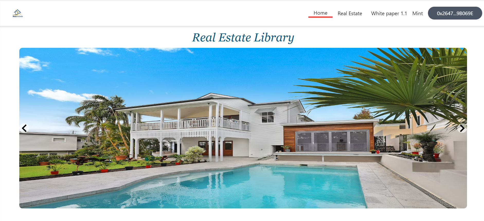
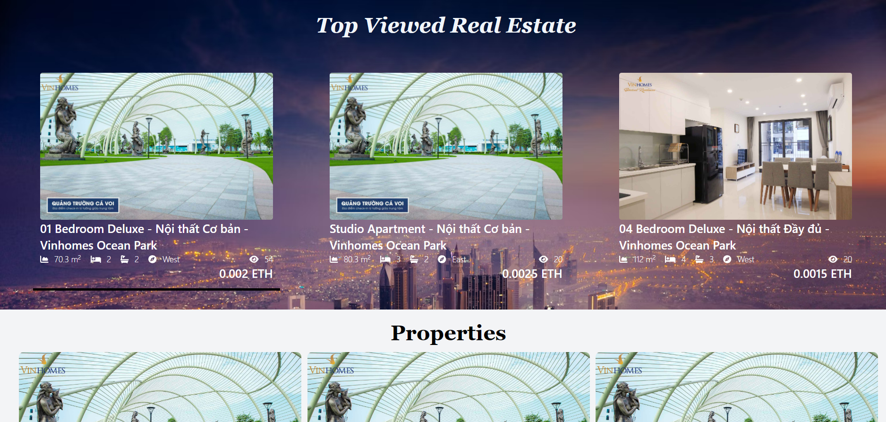
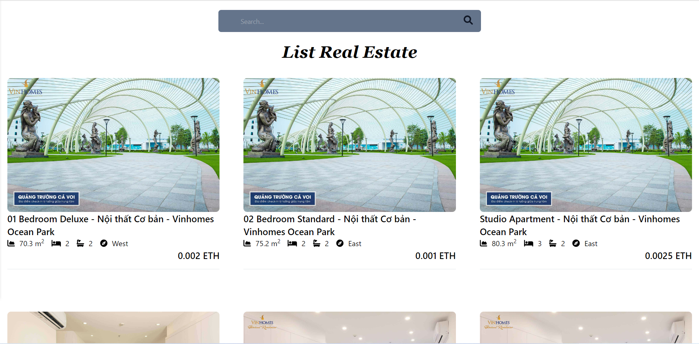
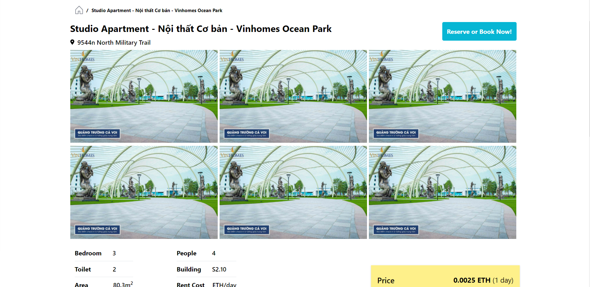
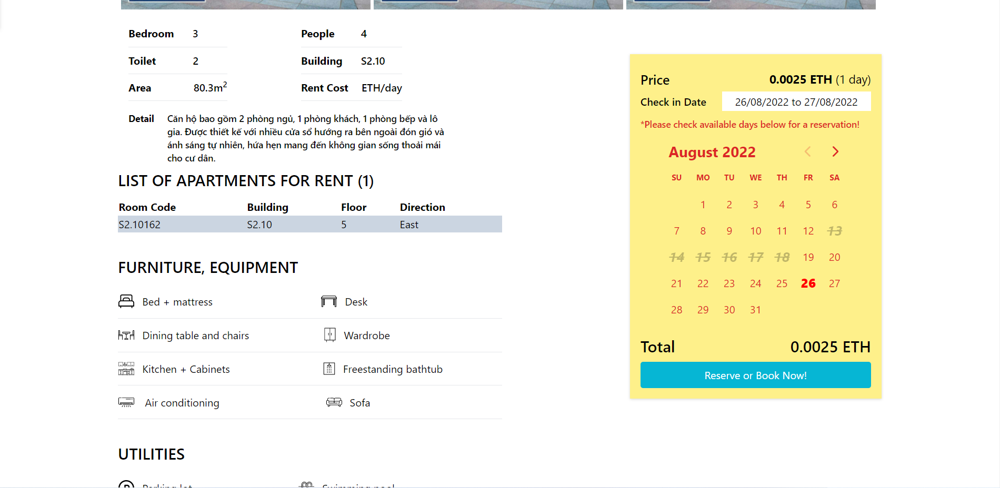
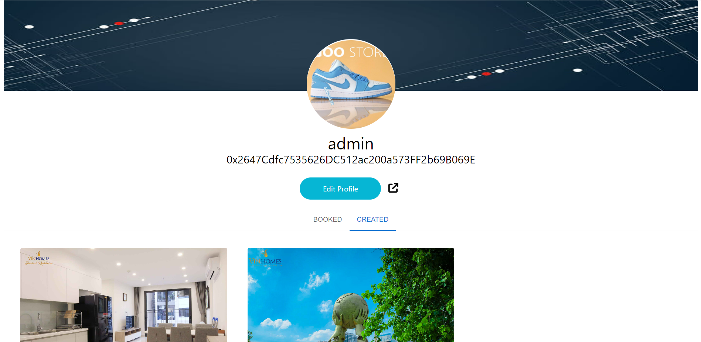
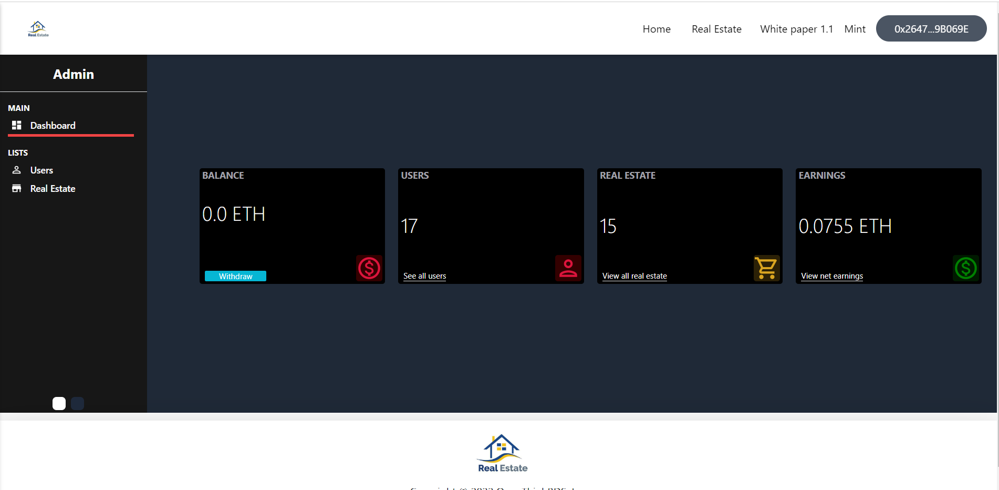
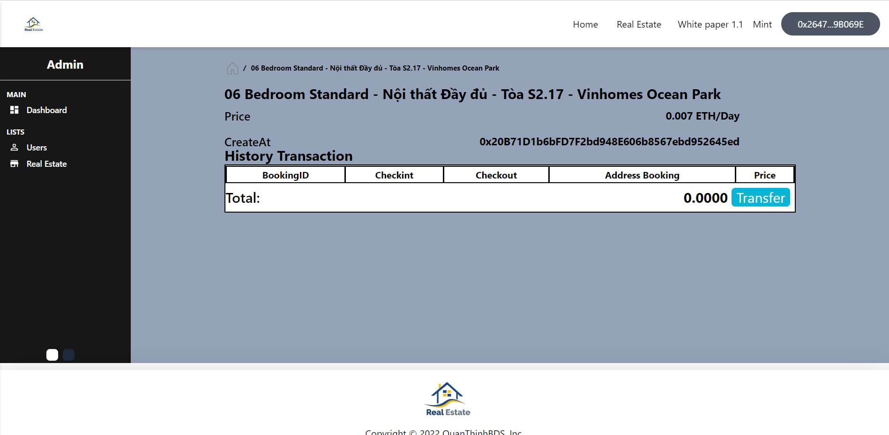
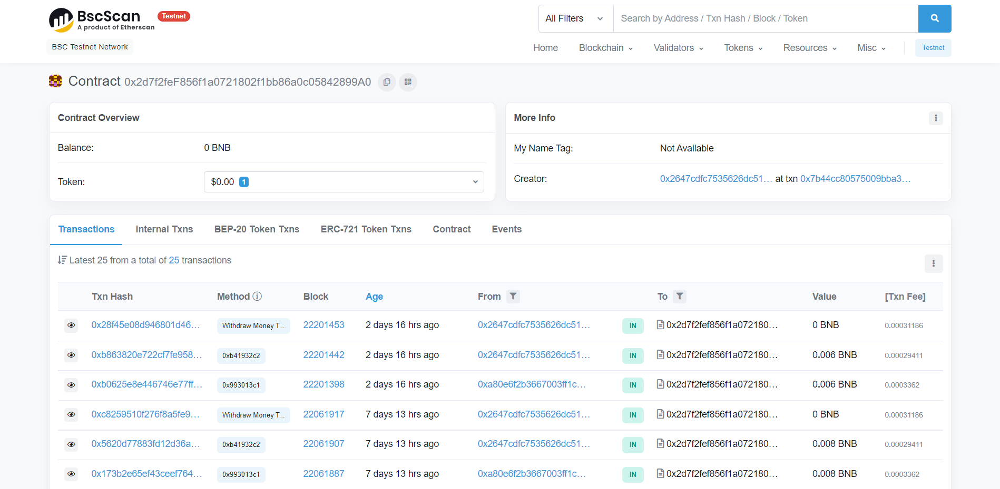

# QuangThinhBDS

<p align=center>

</p>

[](https://github.com/tterb/atomic-design-ui/blob/master/LICENSEs)
[](https://opensource.org/licenses/)
[](http://www.gnu.org/licenses/agpl-3.0)

This project is a rent realestate platform application that uses [OpenZepplin](https://github.com/OpenZeppelin/openzeppelin-solidity).

The contract is compiled and deployed under the ERC-721 non-fungible token standard with hardhat framework. After deploying onto the Ethereum blockchain, users will be able to use this application by interacting with the smart contract through DAPP’s front-end interface.

# ERC-721 Token

ERC-721 non-fungible token:
ERC-721 is a free, open standard that describes how to build non-fungible or unique tokens on the Ethereum blockchain. While most tokens are fungible (every token is the same as every other token), ERC-721 tokens are all unique (with unique ID).

[Reference](https://github.com/ethereum/EIPs/blob/master/EIPS/eip-721.md)

# Contracts

You can find contract detail under `contracts/` directory:

- [`QTMarket.sol`](./client/contracts/QTMarket.sol):
  The implementation of smart contract.

# Tech Stack

**Client:** NextJs, TailwindCSS, Hardhat, MetaMask

**Server:** NodeJs, Mysql

**Blockchain:** Etherscan

# Installation

Install QTRealestate front-end: [QTRealestate front-end](https://github.com/hoangthinh28/QuangThinhBDS/tree/website/client)

```bash
  npm install
  npx hardhat compile
  npx hardhat run --network testnet scripts/deploy.js
  npm run dev
```

Install QTRealestate back-end: [QTRealestate back-end](https://github.com/hoangthinh28/QuangThinhBDS/tree/website/server)

```bash
  npm install
  npm start
```

# Screenshots

<p align=center>





</p>

## Profile

<p align=center>

</p>

## Admin

<p align=center>


</p>

## BSC Scan

<p align=center>

</p>

# Authors

- [@hoangthinh28](https://github.com/hoangthinh28)

- [@quang123654](https://github.com/quang123654)

# Support

For support, email hoangthinhpro2001@gmail.com.

# QT RealEstate
